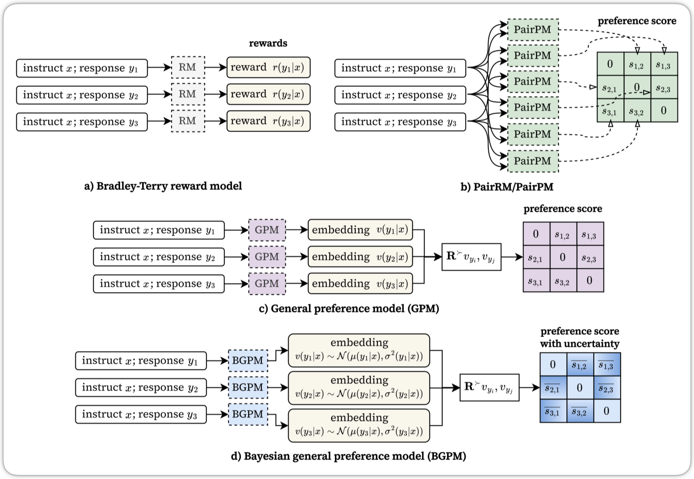

# Active Alignment with Bayesian General Preference Model

This repository contains the official implementation of BGPM, a Bayesian extension of the general preference model (GPM) for sample-efficient downstream alignment of large language models (LLMs) using active learning.

## Abstract

Reinforcement learning from human feedback (RLHF) has become essential for aligning large language models (LLMs) with human preferences, but collecting preference data at scale remains expensive. We propose a Bayesian extension of the recently introduced general preference model (GPM) that enables active learning for sample-efficient preference elicitation. Bayesian GPM (BGPM) outputs probabilistic embeddings with closed-form uncertainty estimates that information-theoretic acquisition functions can utilize to identify the most informative preference queries. Experiments on RewardBench demonstrate that BGPM matches GPM's ability to model complex, intransitive preferences while achieving significant label efficiency gains through active learning and reducing annotation requirements by over 35% compared to random sampling baselines.

## Architecture



*Figure 1: Illustration of (a) Bradley-Terry reward model, (b) PairPM, (c) General Preference Model (GPM), and (d) our proposed Bayesian GPM (BGPM) with probabilistic embeddings.*

## Installation

This project uses `uv` for dependency management.

1.  Sync dependencies:
    ```bash
    uv sync
    ```

2.  Install DeepSpeed:
    ```bash
    uv pip install deepspeed
    ```

3.  Install `flash-attn` manually if needed:
    If dependency conflicts arise regarding `flash-attn`, it is likely due to platform-specific wheel issues. Install it manually using the pre-built wheels matching your CUDA and Torch versions:

    ```bash
    # example format (replace versions with your specific setup)
    uv pip install flash_attn-[flash_attn_version]+cu[cuda_version]torch[torch_version]cp[python_version]-cp[python_version]-linux_x86_64.whl
    ```

## Repository Structure

```text
b_gpm/
├── active_learning/                    # active learning logic
│   ├── acquisition.py                  # MV, BALD, UCB acquisition functions
│   ├── active_learner.py               # main active learning loop
│   ├── batch_selection.py              # diversity-aware batch selection strategies
│   └── pool.py                         # management of unlabeled data pools
├── datasets/                           # dataset loading and preprocessing
├── models/                             # model definitions
│   ├── bayesian_types.py               # probabilistic embedding data structures
│   ├── loss.py                         # bayesian GPM Loss (ELBO), GPM Loss, etc.
│   └── rw_model_general_preference.py  # main modeling code (Gemma/Qwen extensions)
├── trainer/                            # training loops
│   └── rm_trainer_general_preference.py
└── utils/                              # DeepSpeed and distributed utils

scripts/                                # training and AL entry points
├── train_rm_bgpm_al.py                 # active Learning training script
└── train_rm_general_preference.py      # standard offline training script

eval/                                   # inference and evaluation scripts
rewardbench/                            # RewardBench evaluation integration
```

Other directories are, in the current state, unused or inherited from GPM.

## Usage

### Offline training (Standard GPM/BGPM)
To train a model on a static dataset without active learning:

```bash
python scripts/train_rm_general_preference.py \
    --pretrain "base_model_from_hf_or_other_src" \
    --dataset "path/to/dataset" \
    --is_bayesian_gpm \
    --value_head_dim 6 \
    --save_path "output/bgpm_offline" \
    ...
```

### Active learning
To run the active learning loop (Train -> Acquire -> Label -> Retrain):

```bash
python scripts/train_rm_bgpm_al.py \
    --pretrain "base_model_from_hf_or_other_src" \
    --dataset "path/to/unlabeled_pool.jsonl" \
    --acquisition "mv" \
    --al_batch_size 32 \
    --al_max_iterations 20 \
    --is_bayesian_gpm \
    --value_head_dim 6 \
    --save_path "output/bgpm_active_learning" \
    ...
```

Supported acquisition functions:
*   `mv`: Maximum Variance (Closed-form, fastest)
*   `bald`: Bayesian Active Learning by Disagreement
*   `ucb`: Upper Confidence Bound
*   `random`: Random baseline

### Evaluation
Evaluation scripts are provided in `eval/` and `rewardbench/`.

```bash
python rewardbench/run_rm_rewardbench.py \
    --model "output/bgpm_active_learning" \
    --is_bayesian_gpm \
    --value_head_dim 6 \
    ...
```

Note: Please ensure you update the `--pretrain` and `--dataset` paths in the scripts to match your local environment. Pre-trained model weights will be available in the [Releases](https://github.com/muhd-umer/b-gpm/releases) section.

## License

This project is licensed under the MIT License. See the [LICENSE](LICENSE) file for details.